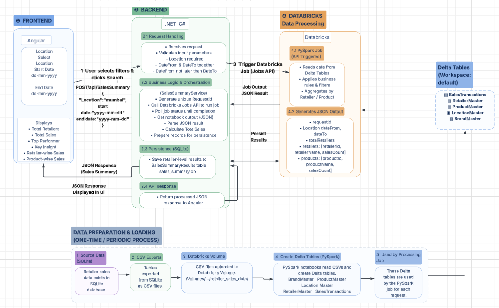

# Retailer Sales Summary Dashboard

A web-based dashboard for generating and viewing retailer sales summaries based on **location and date range**.

The project combines an **Angular frontend**, **ASP.NET Core Web API**, **SQLite database**, and **Databricks/PySpark** data processing to provide summarized retailer sales information.

## Project Overview

The Retailer Sales Summary Dashboard allows users to:

* Select a **location** (mandatory)
* Select a **date range** (optional)
* Use the default date range of the **last 2 months** when dates are not provided
* Generate a retailer sales summary
* View total retailers and total sales
* View retailer-level and product-wise sales
* Visualize sales information through charts
* Handle invalid date selections and unavailable data gracefully

## Architecture


## Technologies Used

### Frontend

* Angular
* TypeScript
* HTML
* CSS

### Backend

* ASP.NET Core Web API
* C#
* REST API

### Data Processing

* Databricks
* PySpark
* Delta Tables
* Databricks Jobs API

### Database

* SQLite

## Main Components

### 1. Angular Frontend

The Angular application provides the user interface for the dashboard.

Users can:

* Select a location
* Select a start date
* Select an end date
* Generate a sales summary
* View summary information
* View retailer and product-level sales
* View charts and key insights
* Download Excel report

The frontend also provides date validation to prevent invalid selections.

### 2. ASP.NET Core Web API

The backend acts as the main application layer between the Angular frontend, database, and Databricks.

It is responsible for:

* Receiving sales summary requests
* Validating input parameters
* Generating a unique request ID
* Triggering the Databricks job through the Jobs API
* Monitoring job completion
* Retrieving the Databricks JSON output
* Processing the returned results
* Persisting results in SQLite
* Returning the processed JSON response to Angular

### 3. Databricks & PySpark

Databricks performs the main sales data processing.

The PySpark job:

1. Reads data from Delta Tables
2. Applies required business rules
3. Filters data based on location and date range
4. Joins relevant datasets
5. Aggregates sales information
6. Calculates summary metrics
7. Generates the final JSON output

The generated output contains information such as:

* Request ID
* Location
* Date range
* Total retailers
* Retailer-level sales
* Product-level sales

### 4. Delta Tables

The Databricks processing job uses Delta Tables as its source data.

The project includes tables such as:

* `SalesTransactions`
* `RetailerMaster`
* `LocationMaster`
* `BrandMaster`
* `ProductMaster`

These tables provide the transaction and master data required for sales processing.

### 5. SQLite Persistence

The ASP.NET Core backend stores generated sales summary results in SQLite.

The `SalesSummaryResults` table is used to persist the processed results so that the generated summaries can be retrieved when required.

## Data Preparation & Loading

Before the processing job can be used, the source data is prepared and loaded into Databricks.

The process is:

```text
SQLite Source Data
       │
       ▼
   CSV Export
       │
       ▼
Databricks Volume
       │
       ▼
Create Delta Tables
       │
       ▼
Used by PySpark Job
```

This is a **one-time or periodic data preparation process**.

The CSV data is uploaded to a Databricks Volume and then processed using PySpark to create the required Delta Tables.

## End-to-End Data Flow

```text
1. User selects Location and Date Range
                    │
                    ▼
2. Angular sends POST request
                    │
                    ▼
3. ASP.NET Core API validates request
                    │
                    ▼
4. API triggers Databricks Job
                    │
                    ▼
5. PySpark reads Delta Tables
                    │
                    ▼
6. Data is filtered and aggregated
                    │
                    ▼
7. Databricks generates JSON result
                    │
                    ▼
8. API retrieves Job output
                    │
                    ▼
9. Result is persisted in SQLite
                    │
                    ▼
10. JSON response returned to Angular
                    │
                    ▼
11. Dashboard displays sales summary
```

## Key Features

### Location Filtering

Location is a required input for generating the sales summary.

The selected location is used to filter the underlying sales data.

### Date Range Filtering

Users can optionally provide a start and end date.

The application handles cases such as:

* End date earlier than start date
* Future dates
* Invalid date combinations
* Date ranges with no available sales data

When no dates are provided, the application uses the **last two months** as the default date range.

### Sales Summary

The dashboard displays key information including:

* Total retailers
* Total sales
* Top performers
* Key insights
* Retailer-wise sales
* Product-wise sales

### Data Visualization

Sales information is presented through charts and visual elements to make the results easier to understand.

## API Request Example

The frontend sends a request similar to:

```json
{
  "location": "Mumbai",
  "startDate": "2026-08-01",
  "endDate": "2026-08-31"
}
```

The backend processes the request and returns the generated sales summary as JSON.

## Getting Started

### Prerequisites

Install the following:

* .NET SDK
* Node.js and npm
* Angular CLI
* SQLite
* Databricks workspace

### Clone the Repository

```bash
git clone <YOUR_GITHUB_REPOSITORY_URL>
cd RetailerSalesDashboard
```

### Run the Backend

Navigate to the API project:

```bash
cd backend
dotnet restore
dotnet run
```

### Run the Frontend

Open another terminal:

```bash
cd retailer-sales-dashboard
npm install
ng serve
```

The Angular application can then be accessed through the local development server.

## Configuration

Sensitive configuration values such as:

* Databricks access tokens
* Workspace credentials
* Job IDs
* Database credentials

should **not** be committed to the repository.

Use environment variables, local configuration, or another secure configuration mechanism for sensitive values.

Example configuration:

```json
{
  "Databricks": {
    "WorkspaceUrl": "YOUR_DATABRICKS_WORKSPACE_URL",
    "JobId": "YOUR_DATABRICKS_JOB_ID"
  }
}
```

## Future Enhancements

Possible future improvements include:

* Additional sales metrics
* Exporting sales reports
* Additional filtering options
* Authentication and authorization
* Cloud database integration
* Additional dashboard visualizations
* Improved processing performance for larger datasets
* Automated data refresh

## Conclusion

The Retailer Sales Summary Dashboard provides an end-to-end solution for generating retailer sales summaries.

It combines a user-friendly Angular dashboard, ASP.NET Core API, SQLite persistence, and Databricks/PySpark data processing to transform sales data into meaningful summaries that can be easily viewed and analyzed.
